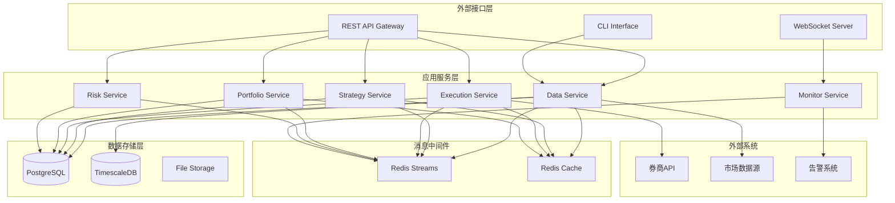

# 港美股量化交易平台设计文档

## 概述

港美股量化交易平台采用事件驱动的微服务架构，基于Rust生态系统构建。系统设计遵循高性能、内存安全和可扩展性原则，支持实时数据处理、策略回测和自动化交易执行。

核心设计理念：
- **事件驱动架构**：通过异步消息传递实现松耦合的服务通信
- **微服务模式**：每个业务领域独立部署和扩展
- **内存安全**：利用Rust的所有权系统防止内存泄漏和数据竞争
- **零成本抽象**：高级抽象不牺牲运行时性能
- **容错设计**：内置重试机制、熔断器和降级策略

## 架构

### 整体架构图



### 技术栈选择

**后端框架**：
- Axum：高性能异步Web框架，基于Tokio构建
- Serde：高性能序列化和反序列化库
- sqlx：异步SQL工具包，支持编译时SQL检查

**数据存储**：
- PostgreSQL：主数据库，存储交易、持仓、配置等结构化数据
- TimescaleDB：时序数据库扩展，优化市场数据存储和查询
- Redis：缓存和消息队列，提供高性能数据访问

**消息系统**：
- Redis Streams：轻量级消息流，支持事件溯源和重放
- Tokio：异步运行时，提供高并发处理能力

**监控运维**：
- Prometheus + Grafana：指标收集和可视化
- 结构化日志：JSON格式日志，便于分析和告警

## 组件和接口

### 数据服务 (Data Service)

**职责**：
- 市场数据采集和标准化处理
- 历史数据存储和查询优化
- 数据质量监控和异常处理

**核心接口**：
```rust
use serde::{Deserialize, Serialize};
use sqlx::PgPool;
use tokio::sync::mpsc;
use std::collections::HashMap;

#[derive(Debug, Clone, Serialize, Deserialize)]
pub struct MarketData {
    pub symbol: String,
    pub timestamp: chrono::DateTime<chrono::Utc>,
    pub price: rust_decimal::Decimal,
    pub volume: i64,
    pub bid_price: Option<rust_decimal::Decimal>,
    pub ask_price: Option<rust_decimal::Decimal>,
}

pub struct DataService {
    db_pool: PgPool,
    redis_client: redis::Client,
    event_sender: mpsc::Sender<DataEvent>,
}

impl DataService {
    pub async fn collect_market_data(&self, symbols: Vec<String>) -> Result<(), DataError>;
    pub async fn get_historical_data(
        &self, 
        symbol: &str, 
        start: chrono::DateTime<chrono::Utc>, 
        end: chrono::DateTime<chrono::Utc>
    ) -> Result<Vec<MarketData>, DataError>;
    pub async fn validate_data_quality(&self, data: &MarketData) -> ValidationResult;
    pub async fn publish_data_event(&self, event: DataEvent) -> Result<(), DataError>;
}
```

**事件发布**：
- `market_data_received`：新市场数据到达
- `data_quality_alert`：数据质量异常
- `data_source_disconnected`：数据源连接中断

### 策略服务 (Strategy Service)

**职责**：
- 策略配置管理和参数验证
- 交易信号生成和强度计算
- 回测引擎和性能分析

**核心接口**：
```rust
use async_trait::async_trait;

#[derive(Debug, Clone, Serialize, Deserialize)]
pub struct StrategyConfig {
    pub name: String,
    pub parameters: HashMap<String, serde_json::Value>,
    pub risk_limits: RiskLimits,
}

#[derive(Debug, Clone, Serialize, Deserialize)]
pub enum SignalType {
    Buy,
    Sell,
    Hold,
}

#[derive(Debug, Clone, Serialize, Deserialize)]
pub struct Signal {
    pub strategy_id: String,
    pub symbol: String,
    pub signal_type: SignalType,
    pub strength: f64, // 0.0 to 1.0
    pub timestamp: chrono::DateTime<chrono::Utc>,
    pub metadata: HashMap<String, serde_json::Value>,
}

#[async_trait]
pub trait Strategy: Send + Sync {
    async fn generate_signals(&self, market_data: &MarketData) -> Result<Vec<Signal>, StrategyError>;
    async fn update_parameters(&mut self, params: HashMap<String, serde_json::Value>) -> Result<(), StrategyError>;
}

pub struct StrategyService {
    strategies: HashMap<String, Box<dyn Strategy>>,
    db_pool: PgPool,
    event_sender: mpsc::Sender<StrategyEvent>,
}

impl StrategyService {
    pub async fn load_strategy(&mut self, config: StrategyConfig) -> Result<(), StrategyError>;
    pub async fn generate_signals(&self, market_data: &MarketData) -> Result<Vec<Signal>, StrategyError>;
    pub async fn run_backtest(
        &self, 
        strategy_id: &str, 
        start: chrono::DateTime<chrono::Utc>, 
        end: chrono::DateTime<chrono::Utc>
    ) -> Result<BacktestResult, StrategyError>;
    pub async fn calculate_performance_metrics(&self, trades: &[Trade]) -> PerformanceMetrics;
}
```

**事件订阅**：
- `market_data_received`：接收市场数据进行信号计算

**事件发布**：
- `signal_generated`：生成新的交易信号
- `backtest_completed`：回测完成
- `strategy_error`：策略执行异常

### 执行服务 (Execution Service)

**职责**：
- 交易信号验证和订单生成
- 券商API集成和订单路由
- 订单状态跟踪和执行确认

**核心接口**：
```python
class ExecutionService:
    async def validate_signal(self, signal: Signal) -> ValidationResult
    async def create_order(self, signal: Signal) -> Order
    async def submit_order(self, order: Order) -> OrderResponse
    async def cancel_order(self, order_id: str) -> CancelResponse
    async def get_order_status(self, order_id: str) -> OrderStatus
```

**事件订阅**：
- `signal_generated`：接收交易信号
- `risk_check_passed`：风控检查通过

**事件发布**：
- `order_created`：订单创建
- `order_filled`：订单成交
- `order_rejected`：订单被拒绝

### 组合服务 (Portfolio Service)

**职责**：
- 持仓数据实时更新和计算
- 盈亏分析和风险指标计算
- 组合价值和绩效报告生成

**核心接口**：
```python
class PortfolioService:
    async def update_position(self, trade: Trade) -> Position
    async def calculate_pnl(self, positions: List[Position], prices: Dict[str, float]) -> PnLReport
    async def get_portfolio_value(self, portfolio_id: str) -> PortfolioValue
    async def generate_daily_report(self, date: datetime) -> DailyReport
```

**事件订阅**：
- `order_filled`：订单成交更新持仓
- `market_data_received`：价格更新计算盈亏

**事件发布**：
- `position_updated`：持仓更新
- `pnl_calculated`：盈亏计算完成
- `portfolio_limit_exceeded`：组合限制超限

### 风险服务 (Risk Service)

**职责**：
- 交易前风险检查和限制验证
- 实时风险监控和告警
- 风险指标计算和报告

**核心接口**：
```python
class RiskService:
    async def check_pre_trade_risk(self, order: Order) -> RiskCheckResult
    async def monitor_portfolio_risk(self, portfolio: Portfolio) -> RiskMetrics
    async def calculate_var(self, positions: List[Position]) -> VaRResult
    async def trigger_risk_alert(self, risk_event: RiskEvent) -> None
```

**事件订阅**：
- `order_created`：订单创建时进行风险检查
- `position_updated`：持仓更新时监控风险
- `market_data_received`：市场数据更新风险计算

**事件发布**：
- `risk_check_passed`：风险检查通过
- `risk_check_failed`：风险检查失败
- `risk_alert_triggered`：风险告警触发

## 数据模型

### 核心实体模型

```python
from pydantic import BaseModel, Field
from datetime import datetime
from decimal import Decimal
from enum import Enum
from typing import Optional, List, Dict

class MarketData(BaseModel):
    symbol: str = Field(..., description="股票代码")
    timestamp: datetime = Field(..., description="时间戳")
    price: Decimal = Field(..., description="价格")
    volume: int = Field(..., description="成交量")
    bid_price: Optional[Decimal] = Field(None, description="买一价")
    ask_price: Optional[Decimal] = Field(None, description="卖一价")
    
class SignalType(str, Enum):
    BUY = "BUY"
    SELL = "SELL"
    HOLD = "HOLD"

class Signal(BaseModel):
    strategy_id: str = Field(..., description="策略ID")
    symbol: str = Field(..., description="股票代码")
    signal_type: SignalType = Field(..., description="信号类型")
    strength: float = Field(..., ge=0, le=1, description="信号强度")
    timestamp: datetime = Field(..., description="生成时间")
    metadata: Dict = Field(default_factory=dict, description="附加信息")

class OrderStatus(str, Enum):
    PENDING = "PENDING"
    SUBMITTED = "SUBMITTED"
    FILLED = "FILLED"
    CANCELLED = "CANCELLED"
    REJECTED = "REJECTED"

class Order(BaseModel):
    order_id: str = Field(..., description="订单ID")
    symbol: str = Field(..., description="股票代码")
    side: SignalType = Field(..., description="买卖方向")
    quantity: int = Field(..., gt=0, description="数量")
    price: Optional[Decimal] = Field(None, description="价格")
    order_type: str = Field(..., description="订单类型")
    status: OrderStatus = Field(default=OrderStatus.PENDING, description="订单状态")
    created_at: datetime = Field(default_factory=datetime.now, description="创建时间")

class Position(BaseModel):
    symbol: str = Field(..., description="股票代码")
    quantity: int = Field(..., description="持仓数量")
    average_cost: Decimal = Field(..., description="平均成本")
    market_value: Decimal = Field(..., description="市值")
    unrealized_pnl: Decimal = Field(..., description="未实现盈亏")
    last_updated: datetime = Field(default_factory=datetime.now, description="最后更新时间")
```

### 数据库设计

**主要表结构**：

```sql
-- 市场数据表 (TimescaleDB)
CREATE TABLE market_data (
    id BIGSERIAL PRIMARY KEY,
    symbol VARCHAR(20) NOT NULL,
    timestamp TIMESTAMPTZ NOT NULL,
    price DECIMAL(18,6) NOT NULL,
    volume BIGINT NOT NULL,
    bid_price DECIMAL(18,6),
    ask_price DECIMAL(18,6),
    created_at TIMESTAMPTZ DEFAULT NOW()
);

-- 创建时序表分区
SELECT create_hypertable('market_data', 'timestamp');

-- 交易订单表
CREATE TABLE orders (
    order_id VARCHAR(50) PRIMARY KEY,
    symbol VARCHAR(20) NOT NULL,
    side VARCHAR(10) NOT NULL,
    quantity INTEGER NOT NULL,
    price DECIMAL(18,6),
    order_type VARCHAR(20) NOT NULL,
    status VARCHAR(20) NOT NULL DEFAULT 'PENDING',
    strategy_id VARCHAR(50),
    created_at TIMESTAMPTZ DEFAULT NOW(),
    updated_at TIMESTAMPTZ DEFAULT NOW()
);

-- 持仓表
CREATE TABLE positions (
    id BIGSERIAL PRIMARY KEY,
    portfolio_id VARCHAR(50) NOT NULL,
    symbol VARCHAR(20) NOT NULL,
    quantity INTEGER NOT NULL,
    average_cost DECIMAL(18,6) NOT NULL,
    last_updated TIMESTAMPTZ DEFAULT NOW(),
    UNIQUE(portfolio_id, symbol)
);

-- 策略配置表
CREATE TABLE strategies (
    strategy_id VARCHAR(50) PRIMARY KEY,
    name VARCHAR(100) NOT NULL,
    config JSONB NOT NULL,
    is_active BOOLEAN DEFAULT true,
    created_at TIMESTAMPTZ DEFAULT NOW(),
    updated_at TIMESTAMPTZ DEFAULT NOW()
);
```

## 正确性属性

*属性是一个特征或行为，应该在系统的所有有效执行中保持为真——本质上是关于系统应该做什么的正式声明。属性作为人类可读规范和机器可验证正确性保证之间的桥梁。*

基于需求文档中的验收标准，我将这些标准转换为可测试的正确性属性：

### 属性 1: 数据处理往返一致性
*对于任何*有效的市场数据，存储到数据库后再查询应该返回等价的数据内容
**验证需求：1.2, 1.4**

### 属性 2: 数据质量检查完整性
*对于任何*接收到的市场数据，如果质量检查失败，系统应该标记异常并发送告警
**验证需求：1.5**

### 属性 3: 策略处理一致性
*对于任何*有效的策略配置和市场数据输入，策略引擎应该生成符合标准格式的交易信号
**验证需求：2.1, 2.3**

### 属性 4: 回测时序处理正确性
*对于任何*历史数据集，回测引擎应该按时间顺序处理数据并保持时序一致性
**验证需求：2.2**

### 属性 5: 交易执行流程一致性
*对于任何*有效的交易信号，执行引擎应该完成信号验证、订单生成、提交和状态更新的完整流程
**验证需求：3.1, 3.2, 3.3**

### 属性 6: 组合状态一致性
*对于任何*订单成交和价格更新，组合管理器应该正确更新持仓、计算盈亏并保持数据一致性
**验证需求：4.1, 4.2, 4.3**

### 属性 7: 持仓限制检查有效性
*对于任何*超过预设限制的持仓情况，系统应该发送风险告警
**验证需求：4.5**

### 属性 8: 风险检查一致性
*对于任何*交易订单，风险管理器应该执行完整的风控检查并根据结果做出正确的允许或拒绝决定
**验证需求：5.1, 5.2, 5.3**

### 属性 9: 风险事件告警完整性
*对于任何*风险指标异常情况，系统应该发送实时告警并记录风险事件
**验证需求：5.5**

### 属性 10: 系统监控告警一致性
*对于任何*系统异常、数据延迟或资源超限情况，平台应该记录日志并发送相应告警
**验证需求：6.2, 6.3, 6.4**

### 属性 11: 健康检查响应完整性
*对于任何*健康检查请求，系统应该返回包含所有模块运行状态的完整响应
**验证需求：6.5**

### 属性 12: 配置管理一致性
*对于任何*配置文件和环境变量，系统应该正确验证、加载和应用配置，包括敏感信息的安全处理
**验证需求：7.1, 7.3, 7.4, 7.5**

### 属性 13: 数据持久化一致性
*对于任何*数据存储操作，系统应该确保事务一致性、容错处理和存储空间管理
**验证需求：8.1, 8.2, 8.5**

## 错误处理

### 错误分类和处理策略

**1. 数据相关错误**
- **数据源连接失败**：自动重连机制，指数退避策略
- **数据格式错误**：数据验证和清洗，异常数据隔离
- **数据延迟**：缓存机制和降级策略

**2. 交易相关错误**
- **订单被拒绝**：错误分析和重试机制
- **券商API异常**：熔断器模式和备用路由
- **网络超时**：超时重试和连接池管理

**3. 系统相关错误**
- **数据库连接失败**：连接池重建和读写分离
- **内存不足**：垃圾回收优化和资源限制
- **服务不可用**：健康检查和服务降级

### 错误处理实现

```python
from enum import Enum
from typing import Optional, Dict, Any
import asyncio
from datetime import datetime, timedelta

class ErrorSeverity(Enum):
    LOW = "LOW"
    MEDIUM = "MEDIUM"
    HIGH = "HIGH"
    CRITICAL = "CRITICAL"

class ErrorHandler:
    def __init__(self):
        self.retry_policies = {
            "data_source": {"max_retries": 5, "backoff_factor": 2},
            "broker_api": {"max_retries": 3, "backoff_factor": 1.5},
            "database": {"max_retries": 3, "backoff_factor": 1.2}
        }
    
    async def handle_error(self, error: Exception, context: Dict[str, Any]) -> bool:
        """统一错误处理入口"""
        error_type = self._classify_error(error)
        severity = self._assess_severity(error, context)
        
        # 记录错误
        await self._log_error(error, context, severity)
        
        # 发送告警
        if severity in [ErrorSeverity.HIGH, ErrorSeverity.CRITICAL]:
            await self._send_alert(error, context, severity)
        
        # 执行恢复策略
        return await self._execute_recovery(error_type, context)
    
    async def _execute_recovery(self, error_type: str, context: Dict[str, Any]) -> bool:
        """执行错误恢复策略"""
        if error_type == "connection_error":
            return await self._handle_connection_error(context)
        elif error_type == "validation_error":
            return await self._handle_validation_error(context)
        elif error_type == "timeout_error":
            return await self._handle_timeout_error(context)
        else:
            return False
```

### 熔断器实现

```python
class CircuitBreaker:
    def __init__(self, failure_threshold: int = 5, timeout: int = 60):
        self.failure_threshold = failure_threshold
        self.timeout = timeout
        self.failure_count = 0
        self.last_failure_time = None
        self.state = "CLOSED"  # CLOSED, OPEN, HALF_OPEN
    
    async def call(self, func, *args, **kwargs):
        """熔断器包装的函数调用"""
        if self.state == "OPEN":
            if self._should_attempt_reset():
                self.state = "HALF_OPEN"
            else:
                raise Exception("Circuit breaker is OPEN")
        
        try:
            result = await func(*args, **kwargs)
            self._on_success()
            return result
        except Exception as e:
            self._on_failure()
            raise e
    
    def _on_success(self):
        """成功调用处理"""
        self.failure_count = 0
        self.state = "CLOSED"
    
    def _on_failure(self):
        """失败调用处理"""
        self.failure_count += 1
        self.last_failure_time = datetime.now()
        
        if self.failure_count >= self.failure_threshold:
            self.state = "OPEN"
```

## 测试策略

### 双重测试方法

系统采用单元测试和基于属性的测试相结合的方法：

**单元测试**：
- 验证具体示例和边缘情况
- 测试集成点和错误条件
- 验证特定业务逻辑的正确性

**基于属性的测试**：
- 验证跨所有输入的通用属性
- 通过随机化实现全面的输入覆盖
- 每个正确性属性对应一个属性测试

### 属性测试配置

**测试框架选择**：Hypothesis (Python的属性测试库)

**测试配置要求**：
- 每个属性测试最少运行100次迭代
- 每个属性测试必须引用其设计文档属性
- 标签格式：**Feature: hk-us-quant-platform, Property {number}: {property_text}**

**示例属性测试**：

```python
import hypothesis.strategies as st
from hypothesis import given, settings
import pytest
from decimal import Decimal
from datetime import datetime

class TestDataProcessingProperties:
    
    @given(
        symbol=st.text(min_size=1, max_size=10),
        price=st.decimals(min_value=0.01, max_value=10000, places=2),
        volume=st.integers(min_value=1, max_value=1000000),
        timestamp=st.datetimes()
    )
    @settings(max_examples=100)
    def test_data_round_trip_consistency(self, symbol, price, volume, timestamp):
        """
        Feature: hk-us-quant-platform, Property 1: 数据处理往返一致性
        对于任何有效的市场数据，存储到数据库后再查询应该返回等价的数据内容
        """
        # 创建市场数据
        market_data = MarketData(
            symbol=symbol,
            price=price,
            volume=volume,
            timestamp=timestamp
        )
        
        # 存储数据
        data_service = DataService()
        asyncio.run(data_service.store_market_data(market_data))
        
        # 查询数据
        retrieved_data = asyncio.run(
            data_service.get_market_data(symbol, timestamp, timestamp)
        )
        
        # 验证一致性
        assert len(retrieved_data) == 1
        assert retrieved_data[0].symbol == market_data.symbol
        assert retrieved_data[0].price == market_data.price
        assert retrieved_data[0].volume == market_data.volume

    @given(
        strategy_config=st.fixed_dictionaries({
            'name': st.text(min_size=1),
            'parameters': st.dictionaries(st.text(), st.floats())
        }),
        market_data=st.builds(MarketData)
    )
    @settings(max_examples=100)
    def test_strategy_processing_consistency(self, strategy_config, market_data):
        """
        Feature: hk-us-quant-platform, Property 3: 策略处理一致性
        对于任何有效的策略配置和市场数据输入，策略引擎应该生成符合标准格式的交易信号
        """
        strategy_service = StrategyService()
        
        # 加载策略
        strategy = asyncio.run(
            strategy_service.load_strategy(strategy_config)
        )
        
        # 生成信号
        signals = asyncio.run(
            strategy_service.generate_signals(market_data)
        )
        
        # 验证信号格式
        for signal in signals:
            assert hasattr(signal, 'strategy_id')
            assert hasattr(signal, 'symbol')
            assert hasattr(signal, 'signal_type')
            assert hasattr(signal, 'strength')
            assert 0 <= signal.strength <= 1
            assert signal.signal_type in ['BUY', 'SELL', 'HOLD']
```

### 单元测试策略

**测试组织**：
- 按服务模块组织测试文件
- 每个服务对应一个测试文件
- 集成测试单独组织

**测试覆盖重点**：
- API端点的输入验证
- 业务逻辑的边界条件
- 错误处理和异常情况
- 外部系统集成点

**模拟和测试数据**：
- 使用pytest-asyncio支持异步测试
- 使用pytest fixtures管理测试数据
- 最小化模拟使用，优先测试真实功能

### 性能测试

**负载测试**：
- 模拟高频市场数据流
- 测试并发订单处理能力
- 验证系统在压力下的稳定性

**基准测试**：
- 数据处理延迟测试
- 订单执行时间测试
- 内存和CPU使用率监控